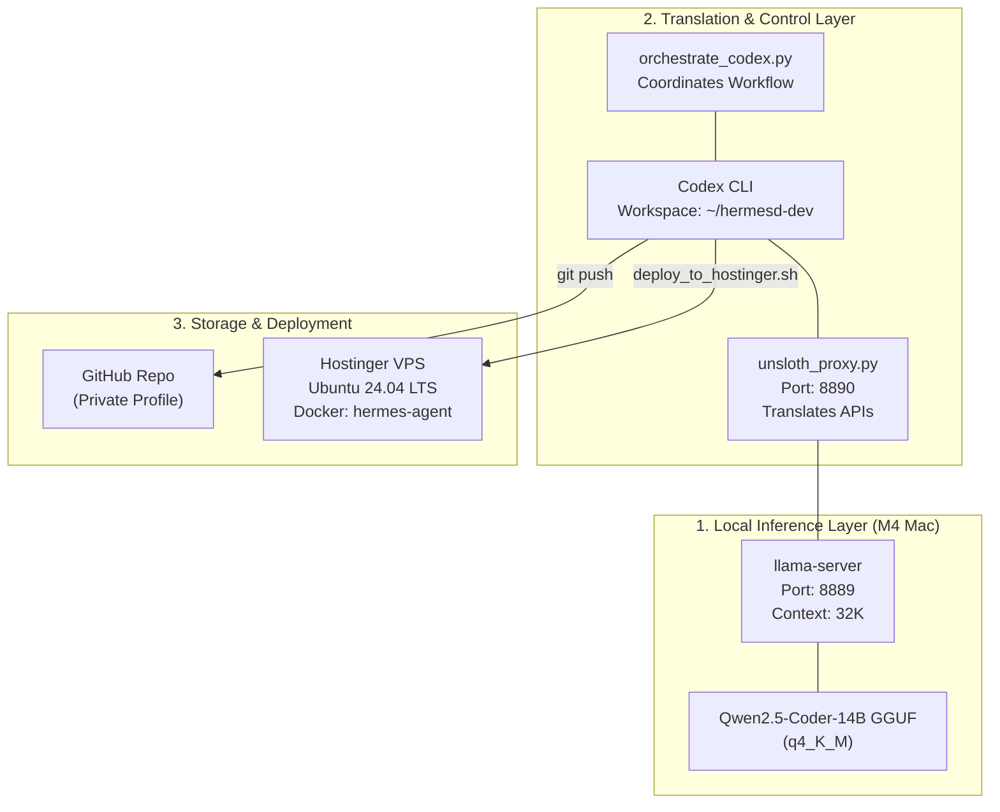

# 📘 The Master Hermes Wiki

This Wiki documents the complete architecture, tech stacks, file system layouts, profiles, and troubleshooting procedures for your local and remote Hermes Agent pipeline.

---

## 🏗️ 1. Technical Architecture (The Pipeline)



### 🛠️ The Tech Stack
* **Local Hardware Engine:** M4 MacBook Pro running local inference.
* **LLM Engine:** `llama.cpp` (`llama-server`) running the quantized `qwen2.5-coder-14b-instruct-q4_k_m.gguf` model.
* **Translation Proxy:** Custom Python server ([unsloth_proxy.py](file:///Users/finessejones1/unsloth_proxy.py)) translating between OpenAI Chat Completions format (used by `llama-server`) and the Responses API format (required by Codex CLI).
* **Workspace Sync:** Git for private profile version control on GitHub (`FinesseJones/hermes-agent-profile`).
* **VPS Deployment:** Docker Compose environment running on a Hostinger VPS.

---

## 📂 2. Master Directory Mappings

> [!TIP]
> Keep your workspace clean by committing only source configurations (`~/hermesd-dev`) and keeping binaries, caches, and massive databases out of Git.

### 💻 Local Directory Structure
| Path | Purpose | Sync/Git Strategy |
| :--- | :--- | :--- |
| **`~/hermesd-dev`** | Active developer workspace. | **Pushed to GitHub.** |
| **`~/.hermes`** | Active local agent runtime, caches, binary libraries (200+ GB). | **Excluded from Git.** Active files deployed to VPS. |
| **`~/.codex`** | Codex CLI configurations, command history, and local databases. | **Excluded from Git.** Configuration written by orchestrator. |
| **`~/AI_models`** | Storage path for large model GGUF files. | **Local only.** Excluded. |

### 💾 External Directory Symbolic Links (Preserved)
The local `~/.hermes/` runtime uses symlinks to preserve disk space on your local SSD by pointing to your external SSD:
* `/Users/finessejones1/.hermes/skills/consolidated/open-antigravity` ➡️ `/Volumes/FinesseJones1 External 1/Projects/Projects In Progress/open-antigravity`
* `/Users/finessejones1/.hermes/skills/consolidated/ask-user-question` ➡️ `/Volumes/FinesseJones1 External 1/Projects/accomplish-ai/packages/agent-core/mcp-tools/ask-user-question`
* `/Users/finessejones1/.hermes/skills/consolidated/complete-task` ➡️ `/Volumes/FinesseJones1 External 1/Projects/accomplish-ai/packages/agent-core/mcp-tools/complete-task`
* `/Users/finessejones1/.hermes/skills/consolidated/dev-browser` ➡️ `/Volumes/FinesseJones1 External 1/Projects/accomplish-ai/packages/agent-core/mcp-tools/dev-browser`
* `/Users/finessejones1/.hermes/skills/consolidated/Project Documents` ➡️ `/Volumes/FinesseJones1 External 1/Projects/Project Documents`
* `/Users/finessejones1/.hermes/skills/consolidated/AntiGravity` ➡️ `/Volumes/FinesseJones1 External 1/Projects/Projects In Progress/AntiGravity`

---

## 👤 3. Active Agent Profiles

Your Hermes runtime has three distinct profiles, which contain custom behaviors, memory structures, and sessions:

1. **`cybersecurity-tech` (1.6 GB)**
   * **Role:** IT & Cybersecurity Engineering assistant.
   * **Purpose:** Running recon loops, script automation, diagnostics, and environment setups.
2. **`jamiefirendstrategist` (82 GB)**
   * **Role:** Strategic Planning and Relationship agent.
   * **Purpose:** Management of large context document sets, long-running strategy files, and deep historical logs. *(Large size is due to extensive memory/history caches).*
3. **`larissa` (265 MB)**
   * **Role:** Operational assistant.
   * **Purpose:** Daily tasks and general administrative pipeline work.

---

## 🌍 4. Hostinger VPS Infrastructure

Your remote runtime runs in a isolated Docker environment hosted by Hostinger.

### 📋 Connection Details
* **Host Address:** `srv1726890.hstgr.cloud`
* **IP Address:** `2.25.165.61`
* **SSH User:** `root`
* **Default Port:** `22`
* **Private SSH Key:** Located at `~/.ssh/id_ed25519` on your Mac.

### 🐳 Docker Configuration
* **Docker Compose Directory:** `/docker/hermes-agent-ttiy`
* **Data Volume (Sync Destination):** `/docker/hermes-agent-ttiy/data`
* **Docker Service Name:** `hermes-agent`
* **Container Image:** `ghcr.io/hostinger/hvps-hermes-agent:latest`
* **Ports:** Container listens internally on `4860`, mapped to external port `32769` on the VPS.

### ⚙️ VPS Commands
Run these inside the VPS (via SSH):
* **Start Container:**
  ```bash
  cd /docker/hermes-agent-ttiy && docker compose up -d
  ```
* **Stop Container:**
  ```bash
  cd /docker/hermes-agent-ttiy && docker compose down
  ```
* **Restart Container:**
  ```bash
  cd /docker/hermes-agent-ttiy && docker compose restart hermes-agent
  ```
* **Check Logs:**
  ```bash
  cd /docker/hermes-agent-ttiy && docker compose logs -f --tail=50 hermes-agent
  ```

---

## 🛠️ 5. Troubleshooting Guide

> [!WARNING]
> Always verify ports `:8889` and `:8890` are open locally before running Codex.

### 🔴 Problem: `llama-server NOT responding on :8889`
* **Reason:** The local LLM engine has stopped running.
* **Fix:** Open a terminal and run the model server:
  ```bash
  ~/.unsloth/llama.cpp/build/bin/llama-server \
    -m ~/Downloads/qwen2.5-coder-14b-instruct-q4_k_m.gguf \
    --port 8889 -c 32768 --parallel 1 \
    --flash-attn on --threads -1 --jinja
  ```

### 🔴 Problem: `unsloth_proxy NOT responding on :8890`
* **Reason:** The translation proxy script has exited.
* **Fix:** The orchestrator script [orchestrate_codex.py](file:///Users/finessejones1/orchestrate_codex.py) will auto-start this if it's down. To start it manually:
  ```bash
  /Users/finessejones1/.hermes/hermes-agent/venv/bin/python -u /Users/finessejones1/unsloth_proxy.py > ~/proxy.log 2>&1 &
  ```

### 🔴 Problem: `Could not resolve host: github.com` during Codex Run
* **Reason:** Codex's built-in sandbox blocks network access.
* **Fix:** Always invoke Codex with the full network bypass argument:
  ```bash
  codex -p local_coder exec --sandbox danger-full-access "your command"
  ```

### 🔴 Problem: Deployment packaging hangs or runs out of disk space
* **Reason:** Symlink loops are resolving to external volumes, packing gigabytes of code.
* **Fix:** Ensure [deploy_to_hostinger.sh](file:///Users/finessejones1/hermesd-dev/scripts/deploy_to_hostinger.sh) uses the `-y` flag in the `zip` command:
  ```bash
  zip -q -y -r "$TEMP_ZIP" . -x ...
  ```

### 🔴 Problem: `Permission denied (publickey)` to VPS
* **Reason:** The public key of your MacBook Pro is not authorized on the VPS.
* **Fix:** Add your public key to the authorized keys on the remote server:
  ```bash
  ssh-copy-id -i ~/.ssh/id_ed25519 root@srv1726890.hstgr.cloud
  ```
